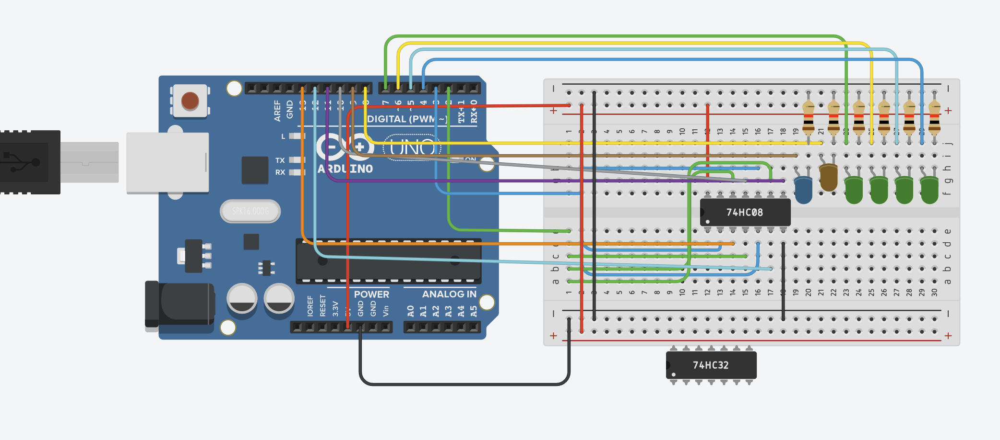
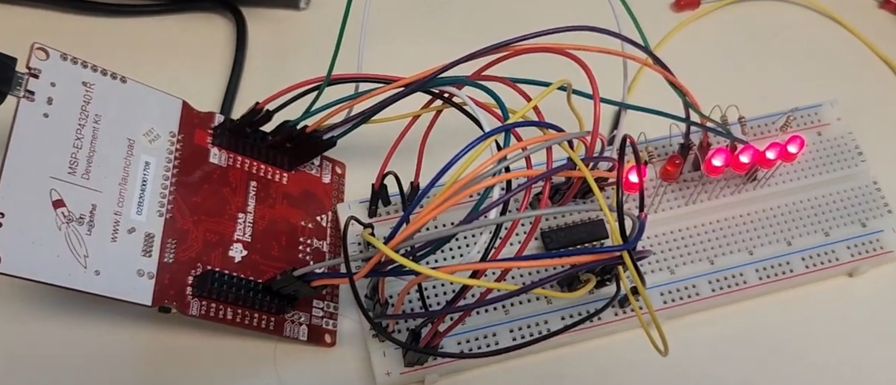

# IC-Tester: Automated Logic Gate Testing System

Project Overview:

This project involved designing and building an advanced automated testing system utilizing the MSP432 microcontroller. The system is specifically intended for testing 7408 (AND) and 7432 (OR) logic gate ICs, with the capability to automatically identify the IC type and display the operational status of each individual gate.

Key Components:
- MSP432 Microcontroller
- 7408 (AND) and 7432 (OR) ICs
- LED Indicators for Gate Status Display and type

Objectives and Functionality:
- Developed a custom C-based program for dynamic parameter updates, allowing for flexibility in adjusting the testing criteria.
- Integrated an automated IC detection algorithm that identifies the type of IC inserted (AND or OR) and verifies each gate's functionality by calculating a minimum pass rate based on gate performance.
- Designed an intuitive interface with LED indicators, where the microcontroller reads the gate outputs and displays the status (pass/fail) of each gate by illuminating corresponding LEDs.
- The program ensures that the logic gates are tested under varying conditions, providing real-time feedback to the user, enhancing troubleshooting and testing efficiency.

Disclaimer: This system serves as a prototype, designed to demonstrate the core functionality of automatic IC detection and testing. It is currently not intended for production use and requires further optimization and refinement.

Note: I did not have colored LEDs on hand during the creation and testing of the physical design and as such all the LEDs are red. Despite this the placements match that of the TinkerCAD virtual model with the blue and yellow LEDs representing AND/OR gate type and the green LEDs representing gate statuses 1-4 with the on status meaning that they are working correctly. Additionally the code must be modified to work with an MSP432 as the code used for simulations in TinkerCAD is for the Uno R3 Arduino and utilizes different pins than those available for the same functionality on the MSP432.
